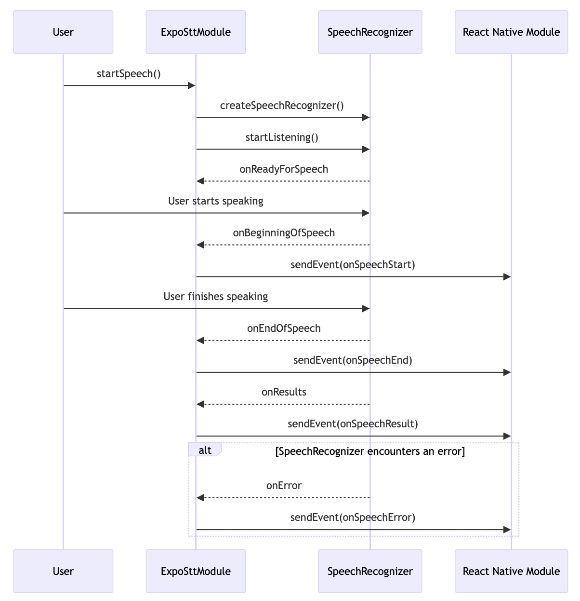
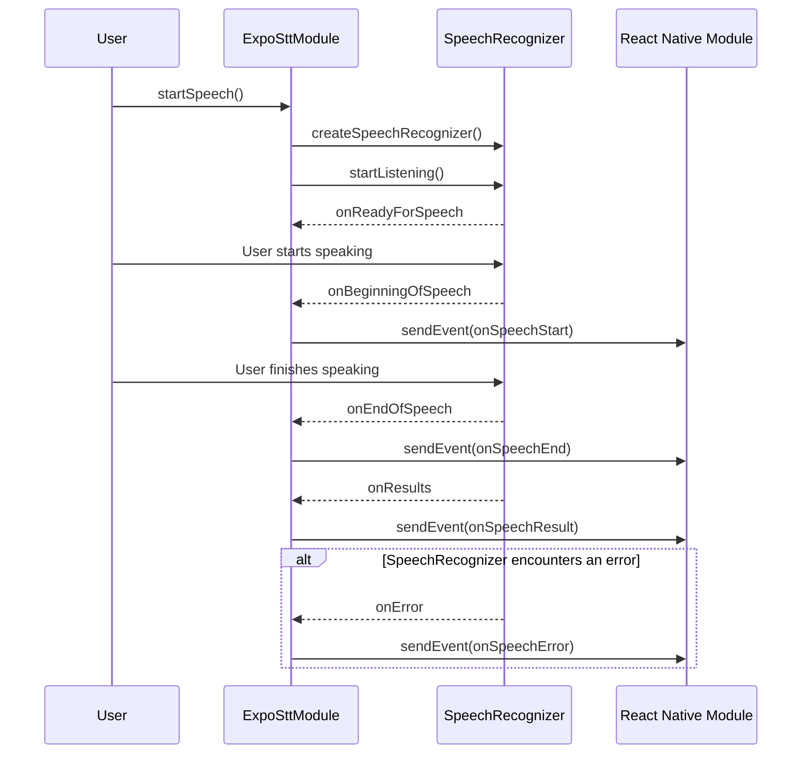

# expo-stt

- Unofficial Speech To Text module for Expo which supported iOS and Android
- Forked [anhtuank7c/expo-stt](https://github.com/anhtuank7c/expo-stt)
- Migrated [react-native-voice functionality](https://github.com/react-native-voice/voice) on [crossplatformkorea/expo-stt](https://github.com/crossplatformkorea/expo-stt), which is forked from [anhtuank7c/expo-stt](https://github.com/anhtuank7c/expo-stt)
- Currently, [anhtuank7c/expo-stt](https://github.com/anhtuank7c/expo-stt) has a separate Google voice recognition modal. Instead, I migrated the [react-native-voice](https://github.com/react-native-voice/voice) code onto [crossplatformkorea/expo-stt](https://github.com/crossplatformkorea/expo-stt), which was created with the [expo module](https://docs.expo.dev/modules/overview), to use the built-in microphone like [react-native-voice](https://github.com/react-native-voice/voice).

# Sequence Diagram

Below is a sequence diagram explaining how each module, including SpeechRecognizer, works.



And below is the [mermaid](https://mermaid.js.org) code to create the above diagram.



# Demo


### Add the package to your npm dependencies

```
npm install expo-stt
or
yarn add expo-stt
```

Remember, this module doesn't support [Expo Go](https://expo.dev/expo-go).
So for Expo project, you will need to [generates native code](https://docs.expo.dev/workflow/prebuild/#clean) (Bare React Native project can skip this step)

```
npx expo prebuild --clean
```

### Configure for iOS (Bare React Native project only)

Run `npx pod-install` after installing the npm package.

## Add missing permissions for iOS

Add following key to plugins of `app.json` in Expo project
This is an optional, just use in case you want to customize the permission string

```
  "plugins": [
    [
      "expo-stt",
      {
        "microphonePermission": "Allow $(PRODUCT_NAME) to access your microphone",
        "speechRecognitionPermission": "Allow $(PRODUCT_NAME) to access your speech recognition"
      }
    ]
  ]
```

For Bare React Native project, you need to add these key to `Info.plist` in `ios` directory

```
  <key>NSMicrophoneUsageDescription</key>
  <string>Allow $(PRODUCT_NAME) to access your microphone</string>
  <key>NSSpeechRecognitionUsageDescription</key>
  <string>Allow $(PRODUCT_NAME) to access your speech recognition</string>
```

## Usage

Register some listeners

```
  import * as ExpoStt from 'expo-stt';

  useEffect(() => {
    const onSpeechStart = ExpoStt.addOnSpeechStartListener(() => {
      setSpokenText("");
      setError(undefined);
      setRecognizing(true);
    });

    const onSpeechResult = ExpoStt.addOnSpeechResultListener(({ value }) => {
      setSpokenText(value.join());
    });

    const onSpeechError = ExpoStt.addOnSpeechErrorListener(({ cause }) => {
      setError(cause);
      setRecognizing(false);
    });

    const onSpeechEnd = ExpoStt.addOnSpeechEndListener(() => {
      setRecognizing(false);
    });

    return () => {
      onSpeechStart.remove();
      onSpeechResult.remove();
      onSpeechError.remove();
      onSpeechEnd.remove();
    };
  }, []);
```

There are some functions available to call such as:

- ExpoStt.startSpeech()
- ExpoStt.stopSpeech()
- ExpoStt.destroySpeech()
- ExpoStt.requestRecognitionPermission()
- ExpoStt.checkRecognitionPermission()

Take a look into `example/App.tsx` for completed example

# Contributing

Contributions are very welcome! Please refer to guidelines described in the [contributing guide](https://github.com/expo/expo#contributing).
